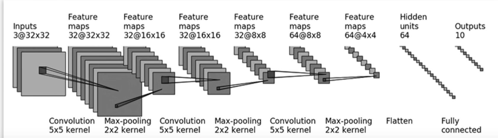

# pytorch的基本使用和神经网络的学习

## 导入pytorch常用库

```python
import torchvision
from torch.utils.data import DataLoader
from torch.utils.tensorboard import SummaryWriter
import torch
import torchvision
from torch import nn
from torch.nn import Conv2d
from torch.utils.data import DataLoader

```
## 加载数据集，以特定数据集为例

### CIFAR-10 数据集是一个图像分类数据集，包含 10 个类别的 32x32 彩色图像。使用 torchvision.datasets.CIFAR10 来加载数据集。存储在 "./dataset" 目录下，并将图像转换为张量。

### DataLoader：
### dataset：要加载的数据集。
### batch_size：每个批次的大小。在这个例子中，每批加载 64 张图像。
### shuffle：在每个 epoch 开始时是否打乱数据顺序。设置为 True 以确保模型不会过拟合于特定的图像顺序。
### num_workers：用于数据加载的子进程数量。设置为 0 表示在主进程中加载数据。
### drop_last：如果最后一个批次的数据不足 batch_size，则丢弃该批次。

```python
test_data = torchvision.datasets.CIFAR10("./dataset", train=False, transform=torchvision.transforms.ToTensor())

test_loader = DataLoader(dataset=test_data, batch_size=64, shuffle=True, num_workers=0, drop_last=True)
```
## Sequential的应用
### Sequential 的主要作用是将多个神经网络层按顺序组合在一起，从而构建一个复合模型。


```python
# 搭建神经网络
class Tudui(nn.Module):
    def __init__(self):
        super(Tudui, self).__init__()
        self.model = nn.Sequential(
            nn.Conv2d(3, 32, 5, 1, 2),
            nn.MaxPool2d(2),
            nn.Conv2d(32, 32, 5, 1, 2),
            nn.MaxPool2d(2),
            nn.Conv2d(32, 64, 5, 1, 2),
            nn.MaxPool2d(2),
            nn.Flatten(),
            nn.Linear(64*4*4, 64),
            nn.Linear(64, 10)
        )

    def forward(self, x):
        x = self.model(x)
        return x
```
## 保存并加载模型，添加模型参数

```python
# 保存方式1,模型结构+模型参数
torch.save(vgg16, "vgg16_method1.pth")

# 保存方式2，模型参数（官方推荐）
torch.save(vgg16.state_dict(), "vgg16_method2.pth")

# 加载模型法1
model = torch.load("vgg16_method1.pth")
print(model)

# 加载模型法2
vgg16 = torchvision.models.vgg16(pretrained=False)
vgg16.load_state_dict(torch.load("vgg16_method2.pth"))
print(vgg16)

vgg16_false = torchvision.models.vgg16(pretrained=False)
vgg16_true = torchvision.models.vgg16(pretrained=True)
#添加子模型
vgg16_true.classifier.add_module('add_linear', nn.Linear(1000, 10))
print(vgg16_true)
print(vgg16_false)
#修改模型参数
vgg16_false.classifier[6] = nn.Linear(4096, 10)
print(vgg16_false)
```
## 二维卷积层 (Conv2d)
### in_channels=3：输入通道数为3。通常用于彩色图像（RGB 图像），因为它们有三个通道（红色、绿色、蓝色）。
### out_channels=6：输出通道数为6。这意味着该卷积层会输出6个特征图。这个数值是可调的，通常根据网络的需求和设计来设定。
### kernel_size=3：卷积核的大小为3x3。卷积核是一个小的滤波器，在输入图像上滑动以执行卷积操作。
### stride=1：卷积核在输入图像上滑动的步幅（stride）为1。这意味着卷积核每次移动一个像素。
### padding=0：没有填充（padding）。这意味着输入图像的边缘不会被填充额外的像素，卷积核只在图像的有效部分进行操作。

```python
dataset = torchvision.datasets.CIFAR10("../data", train=False, transform=torchvision.transforms.ToTensor(),
                                       download=True)
dataloader = DataLoader(dataset, batch_size=64)

class Tudui(nn.Module):
    def __init__(self):
        super(Tudui, self).__init__()
        self.conv1 = Conv2d(in_channels=3, out_channels=6, kernel_size=3, stride=1, padding=0)

    def forward(self, x):
        x = self.conv1(x)
        return x

tudui = Tudui()

writer = SummaryWriter("../logs")

step = 0
for data in dataloader:
    imgs, targets = data
    output = tudui(imgs)
    print(imgs.shape)
    print(output.shape)
    # torch.Size([64, 3, 32, 32])
    writer.add_images("input", imgs, step)
    # torch.Size([64, 6, 30, 30])  -> [xxx, 3, 30, 30]
    output = torch.reshape(output, (-1, 3, 30, 30))
    writer.add_images("output", output, step)
    step = step + 1
```
## 线性层（全连接层）Linear与flatten展平
### 线性层执行的操作可以表示为
$$
\text{output} = \text{input} \times \text{weight}^T + \text{bias}
$$
其中，weight 是层的权重矩阵，bias 是偏置向量。
### flatten将输入的多维张量展平为一维张量
### imgs 的原始形状为 [64, 3, 32, 32]，表示 64 个样本，每个样本有 3 个通道，每个通道是 32x32 的图像。
### 展平操作将 imgs 转换为一维张量。原始张量的总元素数为 64 * 3 * 32 * 32 = 196608

```python

dataset = torchvision.datasets.CIFAR10("../data", train=False, transform=torchvision.transforms.ToTensor(),
                                       download=True)

dataloader = DataLoader(dataset, batch_size=64)

class Tudui(nn.Module):
    def __init__(self):
        super(Tudui, self).__init__()
        self.linear1 = Linear(196608, 10)

    def forward(self, input):
        output = self.linear1(input)
        return output

tudui = Tudui()

for data in dataloader:
    imgs, targets = data
    print(imgs.shape)
    output = torch.flatten(imgs)
    print(output.shape)
    output = tudui(output)
    print(output.shape)
 ```
## 损失函数nn.CrossEntropyLoss()
### nn.CrossEntropyLoss 主要用于衡量模型输出的分类结果与目标标签之间的差异。用于多分类任务，其中每个样本可以属于一个类别。
### 交叉熵损失的公式如下：
$$
\text{Loss} = -\sum_{i} y_i \log(p_i)
$$
其中：
- $y_i$ 是目标类别的标签。
- $p_i$ 是模型预测的类别概率。

对于每个样本，目标是最小化该样本的预测概率和实际类别概率之间的差异。
 ```python
 
class Tudui(nn.Module):
    def __init__(self):
        super(Tudui, self).__init__()
        self.model1 = Sequential(
            Conv2d(3, 32, 5, padding=2),
            MaxPool2d(2),
            Conv2d(32, 32, 5, padding=2),
            MaxPool2d(2),
            Conv2d(32, 64, 5, padding=2),
            MaxPool2d(2),
            Flatten(),
            Linear(1024, 64),
            Linear(64, 10)
        )

    def forward(self, x):
        x = self.model1(x)
        return x


loss = nn.CrossEntropyLoss()
tudui = Tudui()
for data in dataloader:
    imgs, targets = data
    outputs = tudui(imgs)
    result_loss = loss(outputs, targets)
    print("ok")
 ```
 ## 最大池化层 MaxPool2d，取池化核中覆盖最大值
 ### kernel_size=3: 池化窗口的大小，指定了在每个维度上的窗口大小。
 ### ceil_mode=False: 决定是否使用向上取整的方式计算输出尺寸。默认情况下，使用向下取整的方式计算输出尺，即不保留。

 ```python
 class Tudui(nn.Module):
    def __init__(self):
        super(Tudui, self).__init__()
        self.maxpool1 = MaxPool2d(kernel_size=3, ceil_mode=False)

    def forward(self, input):
        output = self.maxpool1(input)
        return output

tudui = Tudui()

writer = SummaryWriter("../logs_maxpool")
step = 0

for data in dataloader:
    imgs, targets = data
    writer.add_images("input", imgs, step)
    output = tudui(imgs)
    writer.add_images("output", output, step)
    step = step + 1

writer.close()
```
## 优化器 optim 和学习率调度器 StepLR
### optim = torch.optim.SGD(tudui.parameters(), lr=0.01)
### 定义了一个随机梯度下降（SGD）优化器。
### tudui.parameters()：传递给优化器的参数，来自于 tudui 模型的所有参数
### lr=0.01：学习率，决定了每次参数更新的步长大小。
### scheduler = StepLR(optim, step_size=5, gamma=0.1)
### 定义了一个学习率调度器。
### StepLR：一个学习率调度器，每隔 step_size 个周期，将学习率乘以 gamma。
### optim：传递给调度器的优化器。
### step_size=5：每5个周期更新一次学习率。
### gamma=0.1：学习率每次更新时乘以的因子。即，每5个周期后，学习率将变为之前的 0.1 倍。
在每次参数更新之前，需要将所有参数的梯度缓存清零。反向传播的梯度是累加的

前向传播：输入数据通过网络的各层，逐层计算输出，最终得到损失值。
损失函数：计算预测值与真实值之间的差异（即损失）。

反向传播：从输出层开始，逐层计算每个参数的梯度。链式法则用来计算复合函数的导数，具体来说，对于每一个参数$\theta{i}$，计算损失 $L$的偏导数$\frac{\partial L}{\partial \theta{i}}$

梯度存储：这些梯度值被存储在每个参数的 grad 属性中。

读取梯度：优化器读取每个参数的 grad 属性中的梯度值。

参数更新：根据梯度值和预设的优化算法（随机梯度下降，SGD），更新每个参数的值。在 SGD 中，参数更新公式如下：
$$
\theta = \theta - \eta \frac{\partial L}{\partial \theta}
$$
其中：
- $\theta$ 表示模型参数
- $\eta$ 表示学习率
- $\frac{\partial L}{\partial \theta}$ 表示损失函数 $L$ 对参数 $\theta$ 的梯度

```python
class Tudui(nn.Module):
    def __init__(self):
        super(Tudui, self).__init__()
        self.model1 = Sequential(
            Conv2d(3, 32, 5, padding=2),
            MaxPool2d(2),
            Conv2d(32, 32, 5, padding=2),
            MaxPool2d(2),
            Conv2d(32, 64, 5, padding=2),
            MaxPool2d(2),
            Flatten(),
            Linear(1024, 64),
            Linear(64, 10)
        )

    def forward(self, x):
        x = self.model1(x)
        return x

loss = nn.CrossEntropyLoss()
tudui = Tudui()
optim = torch.optim.SGD(tudui.parameters(), lr=0.01)
scheduler = StepLR(optim, step_size=5, gamma=0.1)
# 训练 20 个周期
for epoch in range(20):
    # 每个周期的累计损失
    running_loss = 0.0
    for data in dataloader:
        imgs, targets = data
        outputs = tudui(imgs)
        result_loss = loss(outputs, targets)
        optim.zero_grad()#在反向传播之前，将优化器中的梯度清零
        result_loss.backward()#反向传播计算梯度,梯度用于描述损失函数相对于模型参数的变化率
        optim.step()#更新模型参数,使得损失函数逐渐减小
        running_loss = running_loss + result_loss
    scheduler.step() #检测更新学习率   
    print(running_loss)
```
## ReLU 和 Sigmoid 是两种常用的激活函数。在神经网络中用于引入非线性，从而使模型能够学习更复杂的模式和特征。
$$
\text{ReLU(x)} = max(0,x)
$$
### Sigmoid 是一种常用的激活函数，在输出层用于二分类问题
$$
\sigma(x) = \frac{1}{1 + e^{-x}}
$$
非线性：与 ReLU 一样，Sigmoid 也引入了非线性。
平滑性：输出值是连续的，且输出范围固定在 (0, 1) 之间。
梯度消失：在值域的两端（非常接近 0 或 1）处，Sigmoid 函数的梯度非常小，这会导致训练深层神经网络时梯度消失问题。
```python

class Tudui(nn.Module):
    def __init__(self):
        super(Tudui, self).__init__()
        self.relu1 = ReLU()
        self.sigmoid1 = Sigmoid()

    def forward(self, input):
        output = self.sigmoid1(input)
        return output
```
## Compose 变换
变换将按照列表中的顺序依次应用每个变换
```python
dataset_transform = torchvision.transforms.Compose([
    torchvision.transforms.ToTensor()
])
#得到训练集与测试集
train_set = torchvision.datasets.CIFAR10(root="./dataset", train=True, transform=dataset_transform, download=True)
test_set = torchvision.datasets.CIFAR10(root="./dataset", train=False, transform=dataset_transform, download=True)
```


