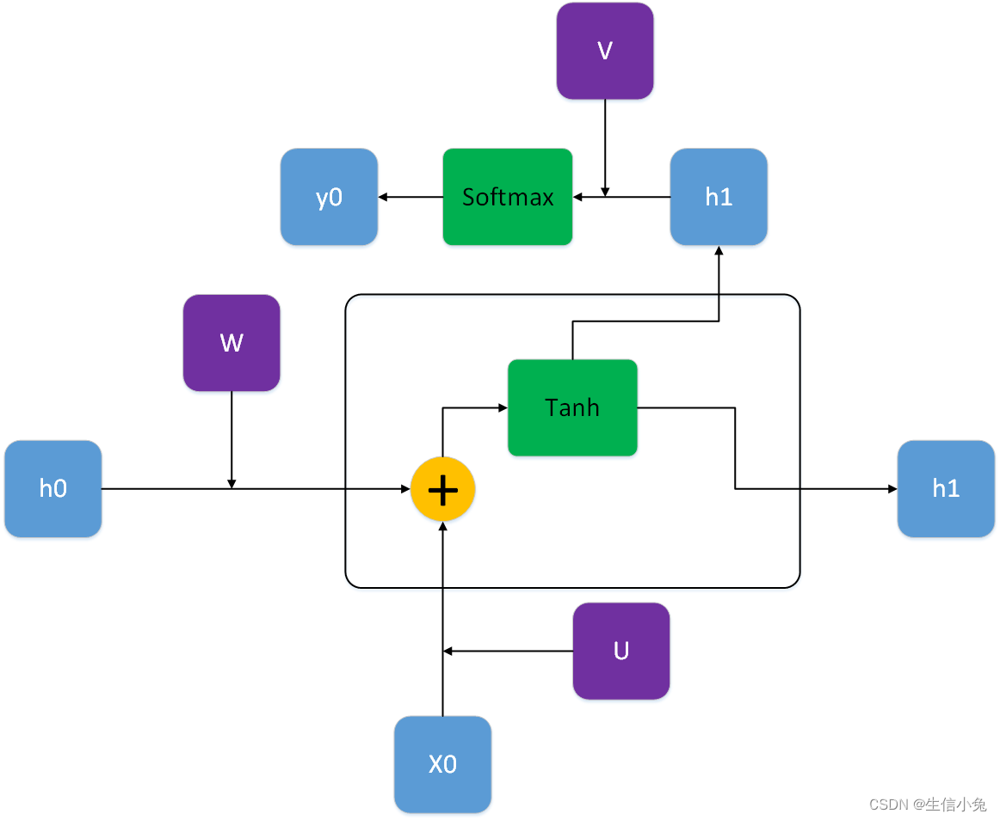
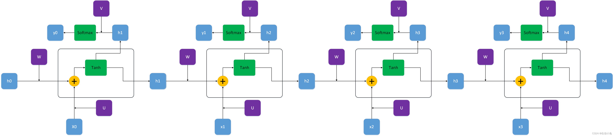
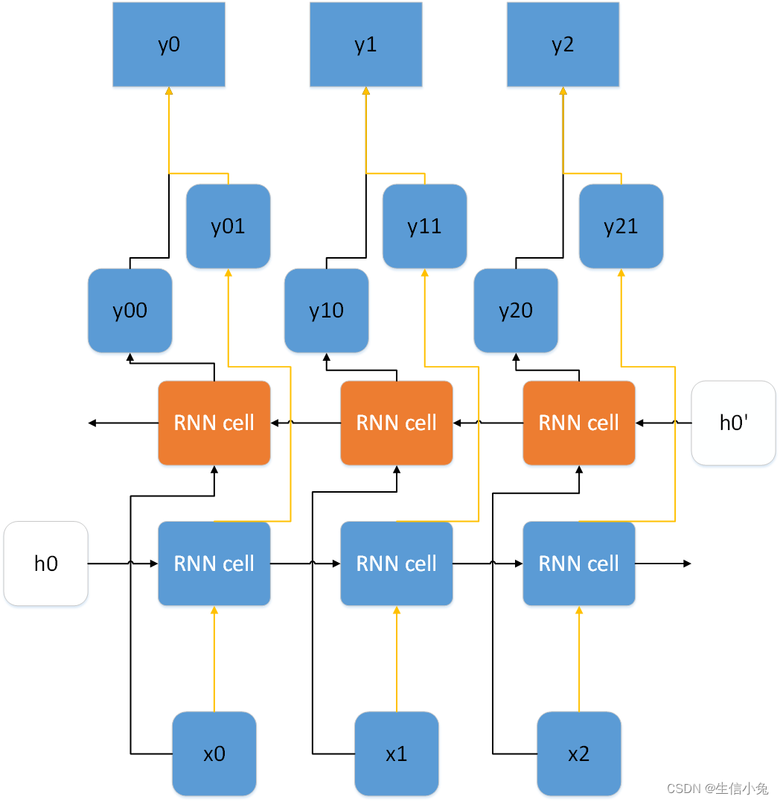
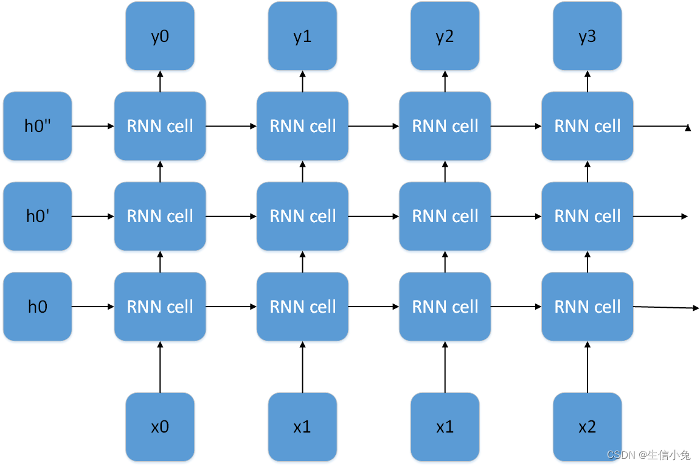
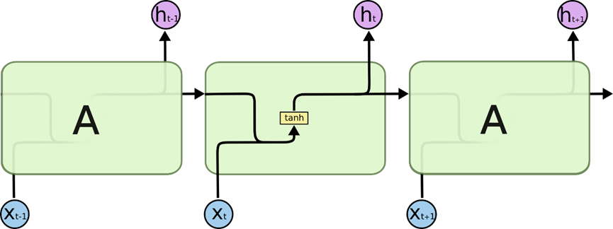
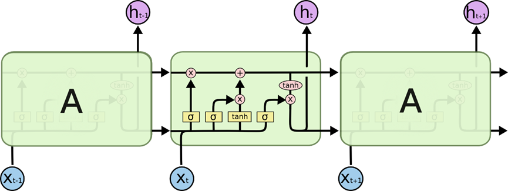
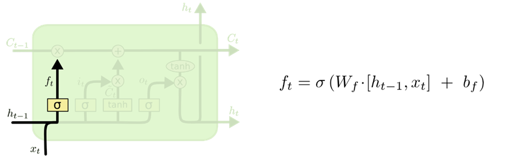
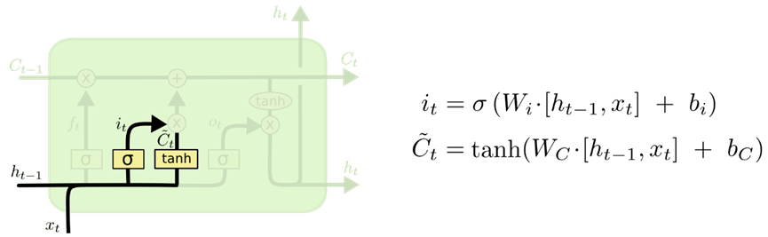
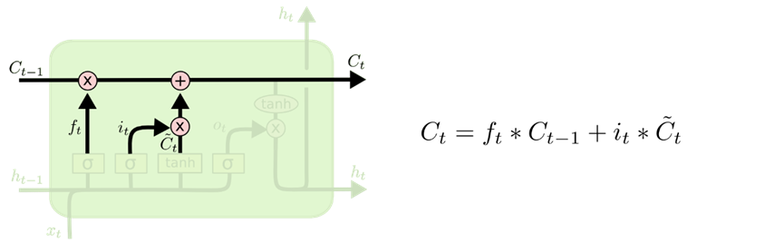
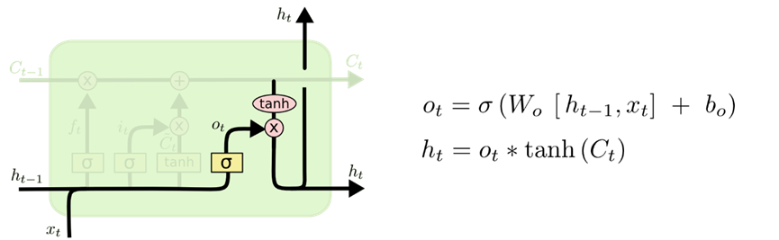

# 第一周周记7.07-7.14

# RNN和LSTM的简单理解

## RNN

### RNN-cell

在RNN中这两个位置通常用tanh和softmax激活函数.x0为t0时刻输入，dim=(p×1)；ht表示隐藏层状态，维度dim=(p×1)，初始时刻的h0有一般设为全0向量，dim=(q×1)；紫色的U、V、W是模型需要学习的参数，U的维度dim=(q×p)，W的维度为dim=(q×q)，V的维度为(q×q)；输出yt的维度为dim=(q×1)。在大多数情况，由于输入输出数据类型相同，p和q相等。
$$
 U \cdot x_0 + b_u + W \cdot h_0 + b_w 
$$
bu和bv为两部分偏置，有的时候也可以不需要。对于下面x0或左边h0部分，矩阵与输入向量相乘再加上偏置b，实际上就相当于一个全连接层。
通过第一个激活函数，得到的h1为
$$
 h_1 = \tanh(U \cdot x_0 + b_u + W \cdot h_0 + b_w) 
$$
h1为得到的隐藏状态，它可以继续像h0输入到第一个RNN cell那样输入到第二个RNN cell。如果第一个RNN需要输出，那么h1还要与V相乘并经过Softmax激活函数得到output
$$
 y_0 = \text{softmax}(V \cdot h_1) 
$$
为了降低模型的复杂度，对于整个RNN，所有的RNN都共用相同的参数U、V、W


### 双向RNN
其隐藏层既有从左向右的传递，也有从右向左的传递，并且这两个方向的传递完全独立，所以模型参数为正向的W、U、V、b_u、b_w与反向的W'、U'、V'、b_u'、b_w'，参数数量为单向RNN的二倍。双向RNN每个RNNcell会有两个输出，所以最终输出结果为这两个输出的拼接。一个输出dim=(q×1)，最终得到输出为(2q×1)



### 深层RNN



## RNN cell

```python
class RNNCell(nn.Module):
    def __init__(self,input_dim,output_dim):
        '''
        :param input_dim: 输入数据维度
        :param output_dim: 输出数据维度
        '''
        super().__init__()
        self.U=nn.Parameter(torch.randn(size=(input_dim,output_dim),dtype=torch.float32))
        self.W=nn.Parameter(torch.randn(size=(output_dim,output_dim),dtype=torch.float32))
        self.V=nn.Parameter(torch.randn(size=(output_dim,output_dim),dtype=torch.float32))
        self.b1=nn.Parameter(torch.randn(size=(1,output_dim),dtype=torch.float32))
        self.b2=nn.Parameter(torch.randn(size=(1,output_dim),dtype=torch.float32))
        self.act1=nn.Tanh()
        self.act2=nn.Sigmoid()
    def forward(self,input,h0):
        h=self.act1(torch.matmul(input,self.U)+torch.matmul(h0,self.W)+self.b1+self.b2)
        output=self.act2(torch.matmul(h,self.V))
        return output,h
```        

## RNN方法  
```python      
class RNN(RNNCell):
    def __init__(self,input_dim,output_dim):
        '''
        :param input_dim :输入数据维度
        :param output_dim:输出数据维度
        output: sequence batch,seq_len,dim
        '''
        RNNCell.__init__(self,input_dim,output_dim)
        self.input_dim=input_dim
        self.output_dim=output_dim
        self.rnncell=RNNCell(self.input_dim,self.output_dim)
    def forward(self,input):
        b,l,h=input.shape
        h0=torch.zeros(size=(b,self.output_dim),dtype=torch.float32)
        input1=input[:,0,:]
        out1,h1=self.rnncell(input1,h0)
        output=[]
        output.append(out1)
        for i in range(l-1):
            out,h2=self.rnncell(input[:,i+1,:],h1)
            h1=h2
            output.append(out)
        output=torch.stack([i for i in output]).permute(1,0,2)
        return output,h1
```
## LSTM
RNN无法处理长期依赖的问题，是由于在反向传播时，梯度会在每个时间步骤中指数级地衰减，这使得远距离的信息无法有效传递
长短时记忆网络（Long Short-Term Memory，LSTM）是一种改进的循环神经网络（RNN）模型，通过引入门控机制来解决RNN无法处理长期依赖关系的问题。
长短时所有RNN都具有一种重复神经网络模块的链式的形式。在标准的RNN中，这个重复的模块只有一个非常简单的结构，例如一个tanh层，无法处理长期依赖关系。


LSTM同样是这样的结构，但是重复的模块拥有一个不同的结构。具体来说，RNN是重复单一的神经网络层，LSTM中的重复模块则包含四个交互的层，三个Sigmoid 和一个tanh层，并以一种非常特殊的方式进行交互。


###  LSTM工作流程
1. 忘记门
当新的输入进入LSTM网络时，忘记门会决定哪些信息应该被遗忘或保留。

2. 输入门
当新的输入进入LSTM网络时，输入门会决定哪些信息应该被保留并更新细胞状态。

3. 细胞状态
细胞状态可以被看作是整个LSTM网络的核心，它可以存储和传递信息，同时也能够控制信息的流动和更新.

4. 输出门
当需要将当前时间步的信息传递到下一层或输出层时，需要通过输出门来控制哪些信息应该被输出。

### LSTMcell
```python
class LSTMCell(nn.Module):
    """
    ## Long Short-Term Memory Cell
    """
​
    def __init__(self, input_size: int, hidden_size: int, layer_norm: bool = False):
        super().__init__()
​
        #W_i W_f W_o W_C 四个线性层运算可以用一个线性层进行合并
        self.hidden_lin = nn.Linear(hidden_size, 4 * hidden_size)
        self.input_lin = nn.Linear(input_size, 4 * hidden_size, bias=False)
​
        # 是否使用layer normalizations
        # 使用layer normalizations可以获得更好的结果
        if layer_norm:
            self.layer_norm = nn.ModuleList([nn.LayerNorm(hidden_size) for _ in range(4)])
            self.layer_norm_c = nn.LayerNorm(hidden_size)
        else:
            self.layer_norm = nn.ModuleList([nn.Identity() for _ in range(4)])
            self.layer_norm_c = nn.Identity()
​
    def forward(self, x: torch.Tensor, h: torch.Tensor, c: torch.Tensor):
        # c和h为上一时刻的state，x为当前时刻的输入
        ifgo = self.hidden_lin(h) + self.input_lin(x)
        # 输出的结果代表四个门的各自输出拼接在一起，所以我们在这将其拆开
        ifgo = ifgo.chunk(4, dim=-1)
​
        # 使用layer normalizations，非必要
        ifgo = [self.layer_norm[i](ifgo[i]) for i in range(4)]
​
        i, f, g, o = ifgo
        c_next = torch.sigmoid(f) * c + torch.sigmoid(i) * torch.tanh(g)
​
        h_next = torch.sigmoid(o) * torch.tanh(self.layer_norm_c(c_next))
​
        return h_next, c_next
```
### LSTM模型
```python
class LSTM(nn.Module):
    """
     LSTM
    """
​
    def __init__(self, input_size: int, hidden_size: int, n_layers: int):
        """
        有n_layers层LSTMCell 的 LSTM.
        """
​
        super().__init__()
        self.n_layers = n_layers
        self.hidden_size = hidden_size
        # 对每一层创建LSTMCell，第一层要特殊处理
        self.cells = nn.ModuleList([LSTMCell(input_size, hidden_size)] +
                                   [LSTMCell(hidden_size, hidden_size) for _ in range(n_layers - 1)])
​
    def forward(self, x: torch.Tensor, state: Optional[Tuple[torch.Tensor, torch.Tensor]] = None):
        """
        x 的输出形状为：[n_steps, batch_size, input_size]
        state 包含了传递过来的state即(h, c), h和c各自的形状为[batch_size, hidden_size].
        """
        n_steps, batch_size = x.shape[:2]
​
        # 第一层的输入需要特殊处理
        if state is None:
            h = [x.new_zeros(batch_size, self.hidden_size) for _ in range(self.n_layers)]
            c = [x.new_zeros(batch_size, self.hidden_size) for _ in range(self.n_layers)]
        else:
            (h, c) = state
            h, c = list(torch.unbind(h)), list(torch.unbind(c))
​
        # 创建用来收集每个time step下的结果输出
        out = []
        for t in range(n_steps):
            # 第一个时刻的输入为自己
            inp = x[t]
            # 遍历每个layer
            for layer in range(self.n_layers):
                h[layer], c[layer] = self.cells[layer](inp, h[layer], c[layer])
                # 将当前层的输出当作下一层的输入
                inp = h[layer]
            # 收集最后一个时刻的输出
            out.append(h[-1])
​
        # 将所有的输出叠加起来
        out = torch.stack(out)
        h = torch.stack(h)
        c = torch.stack(c)
​
        return out, (h, c)        
