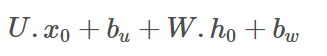
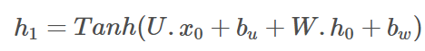
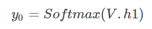

# RNN和LSTM的简单理解

## RNN

### RNN-cell

在RNN中这两个位置通常用tanh和softmax激活函数.x0为t0时刻输入，dim=(p×1)；ht表示隐藏层状态，维度dim=(p×1)，初始时刻的h0有一般设为全0向量，dim=(q×1)；紫色的U、V、W是模型需要学习的参数，U的维度dim=(q×p)，W的维度为dim=(q×q)，V的维度为(q×q)；输出yt的维度为dim=(q×1)。在大多数情况，由于输入输出数据类型相同，p和q相等。

bu和bv为两部分偏置，有的时候也可以不需要。对于下面x0或左边h0部分，矩阵与输入向量相乘再加上偏置b，实际上就相当于一个全连接层。
通过第一个激活函数，得到的h1为

h1为得到的隐藏状态，它可以继续像h0输入到第一个RNN cell那样输入到第二个RNN cell。如果第一个RNN需要输出，那么h1还要与V相乘并经过Softmax激活函数得到output

为了降低模型的复杂度，对于整个RNN，所有的RNN都共用相同的参数U、V、W

### 双向RNN
其隐藏层既有从左向右的传递，也有从右向左的传递，并且这两个方向的传递完全独立，所以模型参数为正向的W、U、V、b_u、b_w与反向的W'、U'、V'、b_u'、b_w'，参数数量为单向RNN的二倍。双向RNN每个RNNcell会有两个输出，所以最终输出结果为这两个输出的拼接。一个输出dim=(q×1)，最终得到输出为(2q×1)

### 深层RNN

## RNN cell
```python
class RNNCell(nn.Module):
    def __init__(self,input_dim,output_dim):
        '''
        :param input_dim: 输入数据维度
        :param output_dim: 输出数据维度
        '''
        super().__init__()
        self.U=nn.Parameter(torch.randn(size=(input_dim,output_dim),dtype=torch.float32))
        self.W=nn.Parameter(torch.randn(size=(output_dim,output_dim),dtype=torch.float32))
        self.V=nn.Parameter(torch.randn(size=(output_dim,output_dim),dtype=torch.float32))
        self.b1=nn.Parameter(torch.randn(size=(1,output_dim),dtype=torch.float32))
        self.b2=nn.Parameter(torch.randn(size=(1,output_dim),dtype=torch.float32))
        self.act1=nn.Tanh()
        self.act2=nn.Sigmoid()
    def forward(self,input,h0):
        h=self.act1(torch.matmul(input,self.U)+torch.matmul(h0,self.W)+self.b1+self.b2)
        output=self.act2(torch.matmul(h,self.V))
        return output,h
```        

## RNN方法  
```python      
class RNN(RNNCell):
    def __init__(self,input_dim,output_dim):
        '''
        :param input_dim :输入数据维度
        :param output_dim:输出数据维度
        output: sequence batch,seq_len,dim
        '''
        RNNCell.__init__(self,input_dim,output_dim)
        self.input_dim=input_dim
        self.output_dim=output_dim
        self.rnncell=RNNCell(self.input_dim,self.output_dim)
    def forward(self,input):
        b,l,h=input.shape
        h0=torch.zeros(size=(b,self.output_dim),dtype=torch.float32)
        input1=input[:,0,:]
        out1,h1=self.rnncell(input1,h0)
        output=[]
        output.append(out1)
        for i in range(l-1):
            out,h2=self.rnncell(input[:,i+1,:],h1)
            h1=h2
            output.append(out)
        output=torch.stack([i for i in output]).permute(1,0,2)
        return output,h1
```
## LSTM
